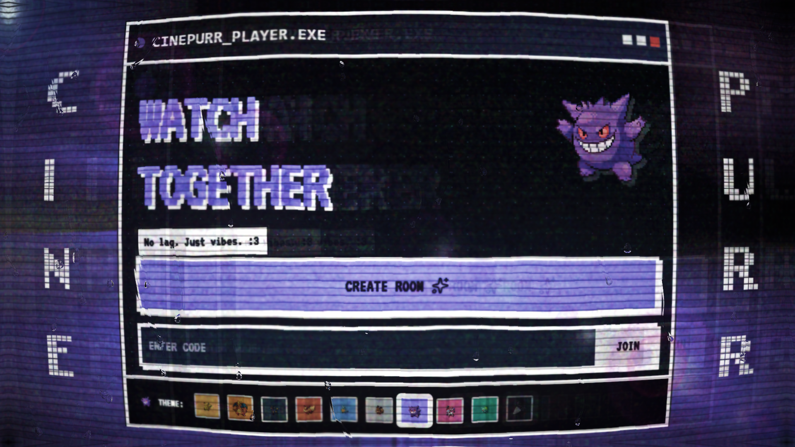

# CinePurr Watch Together

[](https://youtu.be/i0A-mW8Lt8M)

CinePurr is a retro pixel-art watch-together platform built to make shared viewing feel like a game night instead of a bare video player. Create real-time rooms, sync playback, chat live, build shared queues, unlock progression systems, and jump into built-in minigames without leaving the app.

**Live app:** [https://cinepurr.me](https://cinepurr.me)  
**Demo video:** [https://youtu.be/i0A-mW8Lt8M](https://youtu.be/i0A-mW8Lt8M)  
**TestSprite evidence:** [testsprite_tests/HACKATHON_EVIDENCE.md](testsprite_tests/HACKATHON_EVIDENCE.md)  
**Architecture:** [ARCHITECTURE.md](ARCHITECTURE.md)  
**Feature inventory:** [FEATURES_IMPLEMENTED.md](FEATURES_IMPLEMENTED.md)

## Why This Project Stands Out

- It is a full product, not a thin prototype: synchronized watch rooms, queue management, real-time chat, profiles, notifications, social systems, admin controls, and study tools all ship in one cohesive app.
- It has strong retention loops: XP, levels, daily quests, streaks, achievements, crates, leaderboards, reactions, friends, groups, and activity feeds make the platform feel alive between watch sessions.
- The real-time layer is central, not cosmetic: Socket.IO powers room presence, shared playback flows, collaborative queues, and live chat behavior across the experience.
- The product has a memorable identity: retro UI, themed mascots, multiple unlockable themes, bilingual support, and PWA installability make it feel distinct the moment it loads.

## TestSprite Hackathon S2 Submission

This repository is submitted for [TestSprite Hackathon S2](https://www.testsprite.com/hackathon-s2). The `testsprite_tests/` directory contains the planning artifacts, generated tests, execution evidence, and judge-facing notes for the submission.

### TestSprite snapshot

- Frontend plan: 13 prioritized scenarios in [testsprite_frontend_test_plan.json](testsprite_tests/testsprite_frontend_test_plan.json)
- Backend plan: 9 API-focused scenarios in [testsprite_backend_test_plan.json](testsprite_tests/testsprite_backend_test_plan.json)
- Generated artifacts: 67 committed `TC*.py` files across multiple TestSprite passes
- Judge guide: [testsprite_tests/README.md](testsprite_tests/README.md) and [testsprite_tests/HACKATHON_EVIDENCE.md](testsprite_tests/HACKATHON_EVIDENCE.md)
- Final proof image: [testsprite_dashboard_proof.png](testsprite_tests/testsprite_dashboard_proof.png)
- Submission demo: [https://youtu.be/i0A-mW8Lt8M](https://youtu.be/i0A-mW8Lt8M)

### Testing progression

| Round | Environment | Result | Key takeaway |
| --- | --- | --- | --- |
| Round 1 | Production (`cinepurr.me`) | 8/30 | Production bot detection blocked automated login and caused auth-heavy downstream failures |
| Round 2 | Local (`localhost:3000`) | 12/13 | TestSprite surfaced real bugs that were fixed immediately |
| Round 3 | Local (`localhost:3000`) | 13/13 | Final targeted local verification passed end-to-end |

### Bugs surfaced and fixed through TestSprite

- Missing "Add to Watchlist" entry point in the TMDB movie detail flow
- YouTube queue additions not appending correctly to the shared room state
- Guest access redirect blocking room entry for non-authenticated users

## Core Product Areas

- **Watch rooms:** synchronized playback for YouTube, MP4, and stream sources with collaborative queues and room invites
- **Social layer:** friends, direct messages, groups, notifications, recent activity, and profile pages
- **Gamification:** XP, streaks, daily quests, achievements, leaderboards, titles, and reward crates
- **Minigames:** six built-in games integrated into the product experience instead of separated into a different app
- **Study mode:** Pomodoro timer, focus tools, study streaks, and dedicated study-room workflows
- **Admin tooling:** user moderation, room oversight, broadcast messaging, VIP management, and system visibility
- **Platform polish:** PWA installability, offline fallback, responsive layouts, and English/Turkish localization

## Feature Highlights

### Real-time watch party system

- Public and private co-watching rooms with shareable invite flows
- Shared playback state for YouTube URLs, direct MP4 content, and stream-oriented room flows
- Queue management with URL add, TMDB-assisted discovery, voting, ordering, and watchlist entry points
- Live room chat with message reactions, typing indicators, and guest-access room participation

### Social and progression systems

- User profiles with collectible identity layers, stats, and social activity
- Friends, direct messages, groups, notifications, and recent-room discovery
- XP, levels, daily quests, streaks, achievements, titles, and reward crates
- Leaderboards, watch history, and rejoin-friendly room flows

### Extra product depth beyond a basic watch app

- Six built-in minigames available inside the product experience
- Study room with Pomodoro sessions, task tracking, dashboard stats, and streak support
- Google Gemini-powered helper chat for recommendations and guidance
- Mini music player and entertainment-focused side features that keep the app sticky outside a single room session

### Admin and operations surface

- Admin panel with maintenance toggles, broadcasts, access control, and room/user management
- Health and analytics endpoints, moderation flows, VIP tooling, and system-status visibility
- Production-minded deployment setup with Docker, Nginx, Prisma, and build-time validation

## Technical Depth

- Next.js App Router front end with a separate Express + Socket.IO real-time server
- PostgreSQL + Prisma data layer with 28 models and 9 migrations
- 50+ API routes spanning rooms, social features, study tools, admin controls, and user progression
- Unit and integration coverage in `tests/` plus committed TestSprite-generated end-to-end assets in `testsprite_tests/`
- PWA support, bilingual UX, and a themed visual identity that carries across the product instead of stopping at the landing page

## Stack

| Layer | Technology |
| --- | --- |
| App framework | Next.js 16, React 19, TypeScript 5 |
| Styling | Tailwind CSS, Motion |
| Real-time | Express, Socket.IO |
| Data | PostgreSQL, Prisma 6 |
| Auth | NextAuth, bcrypt |
| Background work | BullMQ, Redis |
| AI | Google Gemini |
| Observability | `prom-client` |
| Infra | Docker Compose, Nginx, Let's Encrypt |

## What Judges Can Verify Quickly

1. Open the live app and create or join a room.
2. Try queue interactions, reactions, and room discovery flows.
3. Review the TestSprite evidence showing how bugs were found and fixed.
4. Compare the product breadth in the README against the actual route and feature footprint in the repo.

## Quick Judge Path

If you only have a minute, use this order:

1. Watch the [demo video](https://youtu.be/i0A-mW8Lt8M).
2. Open the [live app](https://cinepurr.me).
3. Review [testsprite_tests/HACKATHON_EVIDENCE.md](testsprite_tests/HACKATHON_EVIDENCE.md).
4. Inspect the final TestSprite proof in [testsprite_dashboard_proof.png](testsprite_tests/testsprite_dashboard_proof.png).

## Local Development

### Prerequisites

| Requirement | Version |
| --- | --- |
| Node.js | 22.x |
| PostgreSQL | 14+ |
| Redis | 7+ (optional) |

### Install and run

```bash
git clone https://github.com/lxcario/CinePurr-WatchTogether.git
cd CinePurr-WatchTogether
npm ci
cp .env.example .env
# Fill in DATABASE_URL, NEXTAUTH_SECRET, NEXTAUTH_URL
npx prisma migrate deploy
npm run db:seed
npm run dev
```

In a second terminal, start the real-time server:

```bash
npm run server
```

Then open [http://localhost:3000](http://localhost:3000).

## Repository Map

```text
CinePurr-WatchTogether/
|-- server/                 Express + Socket.IO server
|-- src/
|   |-- app/                Next.js routes and API handlers
|   |-- components/         UI surfaces for rooms, social, games, admin, and study
|   |-- hooks/              Shared client hooks
|   |-- lib/                Auth, Prisma, analytics, i18n, and utilities
|   `-- types/              Shared TypeScript types
|-- prisma/                 Data models, migrations, and seed logic
|-- tests/                  Unit and integration tests
|-- testsprite_tests/       TestSprite-generated artifacts and execution evidence
`-- public/                 Static assets, icons, and Open Graph media
```

## Documentation

- [ARCHITECTURE.md](ARCHITECTURE.md) - system architecture and design notes
- [FEATURES_IMPLEMENTED.md](FEATURES_IMPLEMENTED.md) - feature inventory
- [DEPLOYMENT.md](DEPLOYMENT.md) - deployment guide
- [CHANGELOG.md](CHANGELOG.md) - change history
- [SECURITY_NOTE.md](SECURITY_NOTE.md) - security notes

## Build Notes

- `npm run build` is set up to work as a local validation build without a production database.
- Full runtime still requires real environment variables for authentication, persistence, and real-time services.
- Local development uses Webpack for `next dev` to avoid Turbopack memory issues with the current stylesheet footprint.

## Fair Use Note

CinePurr is an educational, non-commercial hackathon prototype. Some themed art assets and third-party content sources are used only for technical demonstration. All intellectual property rights remain with their respective owners. Any optional donations support development time only and do not grant access to copyrighted material.

Built by [@lxcario](https://github.com/lxcario).
